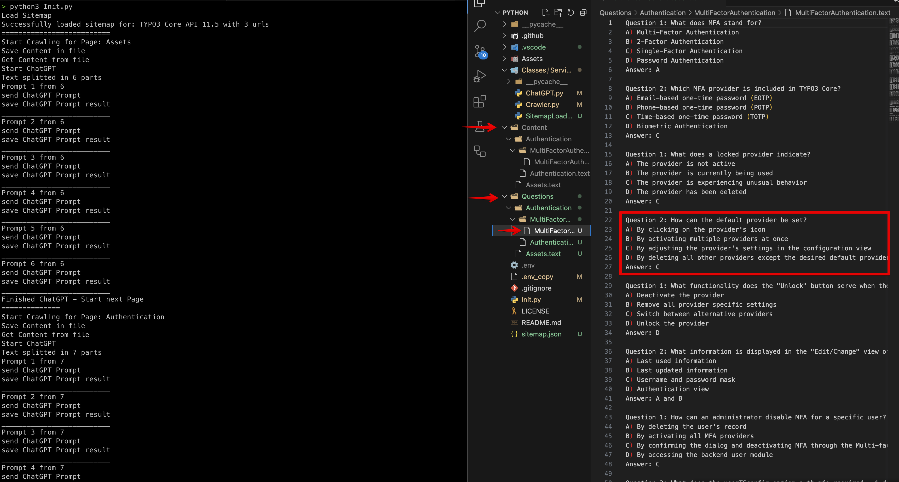
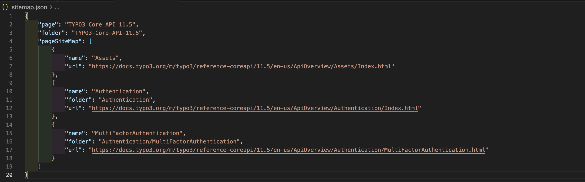

# [POC] chatgpt-docs-multiple-choice-questions-generator
Python 3 (Python 3.9.12) Scripts for generating multiple choice questions from code docs websites.



## Future Idea
The main idea for this project was to create educational data from crawling docs websites like https://docs.typo3.org/m/typo3/reference-coreapi/main/en-us/ApiOverview/Index.html and create randomized multiple choice quizes to learn for a certificate.

## Open AI Api Key
You need a free or paid open AI key from -> https://platform.openai.com/account/api-keys but have allways a look in your usage -> https://platform.openai.com/account/usage.

## Known issues
- Some content from pages are to long to send to chatGPT api and need to get splitted into multiple parts. Because every prompt stands for itself it is possible that context from the whole page gets lost in the questions.
- ...

## Open Tasks
- ~~ Crawl a page tree / multiple pages and not only 1 Page~~ [Done]
- Optimize code
- ~~Make Models and treashold configureble (https://platform.openai.com/docs/models/gpt-3-5)~~ [Done]
- Check and maybe optimize incoming data structure
- Maybe import data directly into a DB?
- Generate qustions in other formats and not only text (json, xml, yml)
- Implement click cli instead of lame print outputs (https://click.palletsprojects.com/en/8.1.x/)
- Optimize code
- add a requirements.txt for pip packages (pip install -r requirements.txt)
- ... 

## Getting started
- Copy the .env_copy file to .env in the same folder
- Fill in the missing variables
- Change the sitemap.json with your urls.
- [WIP] Change the html dom classes (Crawler.py:19 and 21) where the content lies you want to crawl/create questions from. 
- Run the script

## .ENV settings
you can run this with the small "MODEL_TO_USE" gpt-3.5-turbo with a max "TEXT_THRESHOLD" of 2000 and 2 AMOUNT_OF_QUESTIONS_PER_PROMPT or "MODEL_TO_USE" gpt-3.5-turbo-16k with a max "TEXT_THRESHOLD" of 6000 and 6/10 AMOUNT_OF_QUESTIONS_PER_PROMPT. gpt-3.5-turbo-16k would be better to use because there is more context for the question creation but this model cost a bit more. More info a here to find ->  https://openai.com/pricing and https://platform.openai.com/docs/models/gpt-3-5

## sitemap.json

The pages which should be crawled and the folder structure where the data should be stored.

## Folder
- Content - The extracted content from the page
- Questions - The KI generated multiple choice questions in text format.

## Python Packages 

- pip3 install {package}

````
> pip list
Package            Version
------------------ --------
aiohttp            3.8.4
aiosignal          1.3.1
async-timeout      4.0.2
attrs              23.1.0
beautifulsoup4     4.12.2
certifi            2023.5.7
charset-normalizer 3.1.0
frozenlist         1.3.3
idna               3.4
multidict          6.0.4
openai             0.27.6
pip                23.1.2
python-dotenv      1.0.0
requests           2.30.0
setuptools         67.7.2
soupsieve          2.4.1
tqdm               4.65.0
urllib3            2.0.2
wheel              0.37.1
yarl               1.9.2

````

## Run Programm

`` python3 Init.py ``

## About me
I have never programmed in python so be patient with me if some things look a bit fishy ;) just PR if you got some improvement!

